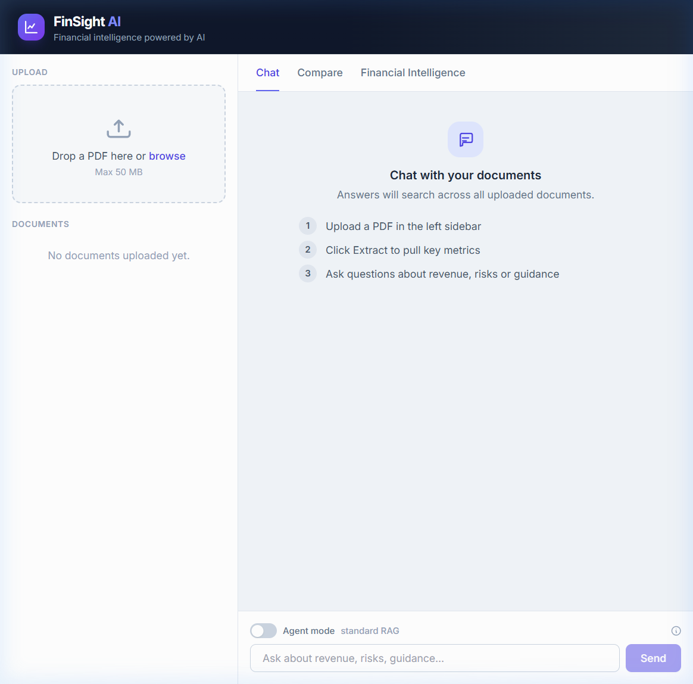
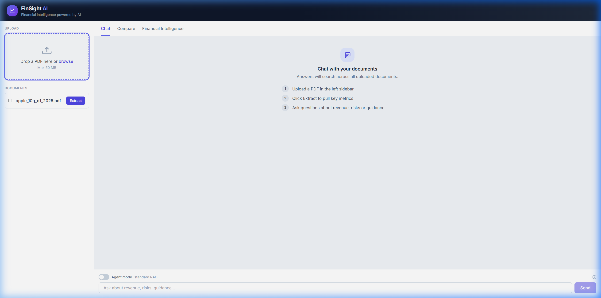
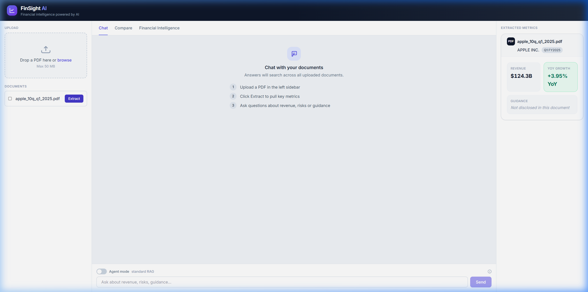
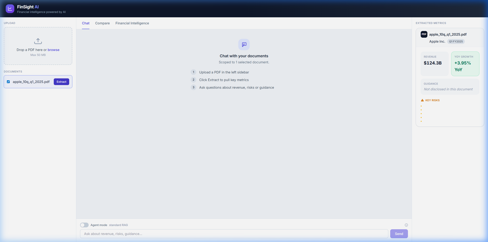
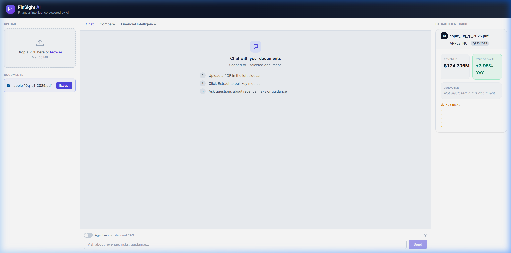
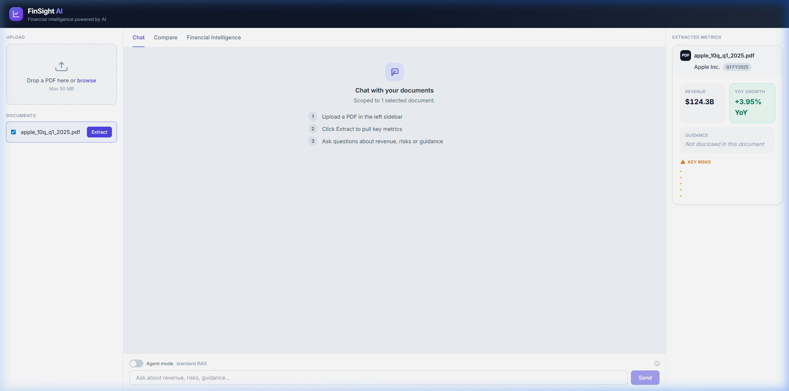
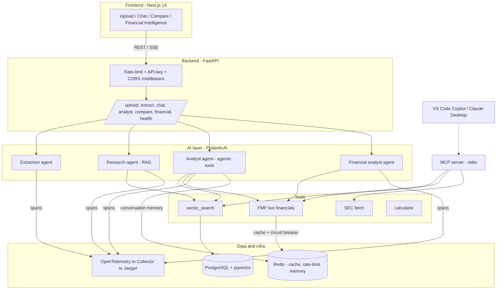

# FinSight AI

> AI-powered financial intelligence platform — ingest financial PDFs (earnings reports, SEC filings, investor decks), extract structured metrics with LLMs, and analyse them through a Retrieval-Augmented Generation (RAG) chat, an autonomous tool-calling agent, and a live-market Financial Intelligence terminal.

<!-- CI & Quality -->
[](https://github.com/ricardo-04/FinSight-AI/actions/workflows/ci.yml)
[](https://docs.astral.sh/ruff/)
[](https://www.python.org/)
[](LICENSE)

<!-- AI & Core Stack -->
[](https://ai.pydantic.dev/)
[](https://build.nvidia.com/)
[](https://github.com/pgvector/pgvector)
[](https://modelcontextprotocol.io/)

<!-- Web & Infra -->
[](https://nextjs.org/)
[](https://fastapi.tiangolo.com/)
[](https://www.docker.com/)
[](https://opentelemetry.io/)

---



---

## Table of contents

- [Why I built this](#why-i-built-this)
- [What I learned](#what-i-learned)
- [What it does](#what-it-does)
- [Demo (video + screenshots)](#demo-video--screenshots)
- [Architecture](#architecture)
- [The AI layer](#the-ai-layer)
  - [Agents & Agentic AI](#agents--agentic-ai)
  - [LLM provider abstraction](#llm-provider-abstraction)
  - [RAG pipeline](#rag-pipeline)
  - [Prompt registry](#prompt-registry)
  - [MCP server](#mcp-server)
- [Observability (OpenTelemetry)](#observability-opentelemetry)
- [Production hardening](#production-hardening)
- [Developing with AI agents](#developing-with-ai-agents)
- [Tech stack](#tech-stack)
- [Project structure](#project-structure)
- [Running locally](#running-locally)
- [Running with Docker](#running-with-docker)
- [API surface](#api-surface)
- [Configuration](#configuration)
- [Security notes](#security-notes)

---

## Why I built this

Financial documents — 10-Qs, 10-Ks, earnings decks — are dense, inconsistent, and buried behind reading hundreds of pages of regulatory prose. I built FinSight AI as a hands-on vehicle to go deep on the emerging AI engineering stack: **agentic AI, RAG, and the Model Context Protocol (MCP)**.

The domain is intentionally hard. A Berkshire Hathaway 10-Q is ~227k characters across 69 chunks; a naive retriever never reaches the income statement on page 40. That constraint forced me to design real solutions — chunk prioritisation by financial-keyword density, guardrailed tool loops, streaming SSE, circuit breakers — rather than toy examples.

The goal was to build something I'd actually use, that showcases every layer of the modern AI engineering stack from the LLM call to the production infra.

---

## What I learned

Building FinSight AI from the ground up was my deepest dive yet into applied AI engineering. Here are the key lessons that shaped the final design:

### 🤖 Agentic AI & multi-step reasoning
Autonomous agents are compelling but need **explicit guardrails** to be safe to ship. Unbounded tool loops can silently blow through token budgets and rate limits. I wired `UsageLimits` (max requests + max tool calls), per-tool `asyncio.wait_for` timeouts, and output truncation to keep every agent run predictable and cost-bounded — without sacrificing the ability to do genuine multi-step reasoning.

### 📚 RAG is not just vector search
Retrieval quality makes or breaks a grounded LLM answer. I learned that:
- **Chunking strategy matters** — overlapping windows preserve context at boundaries.
- **Chunk prioritisation is essential for long docs** — ranking by financial-keyword density before feeding to the extractor made the difference between finding Apple's revenue and finding the cover page.
- **Hybrid retrieval** (semantic + BM25-style signals) is worth the complexity at production scale.
- The SQLite fallback (cosine similarity in Python) let me develop and test the entire RAG pipeline without a running Postgres instance.

### 🔌 Model Context Protocol (MCP)
MCP is a genuinely elegant protocol for exposing tool capabilities to any LLM client. Building a standalone `stdio` server with **FastMCP** taught me how tool schemas, argument validation, and session lifecycle work under the hood — and how the same backend tools can serve both a web UI and an IDE copilot without duplication.

### 🏗️ LLM provider abstraction
Swapping providers mid-project (NVIDIA NIM → Ollama → OpenAI) is painful without a clean seam. I built a single `llm_provider.py` module that presents an OpenAI-compatible interface regardless of what's underneath. This let me switch models for cost/latency experiments with a single env var change.

### 📡 Observability is not optional for AI systems
LLM calls are black boxes. Without **OpenTelemetry spans** wrapping every agent run and tool call, debugging a bad answer means guessing. Structured JSON logs with injected `trace_id` let me correlate a frontend error directly to the retrieval span that returned zero results — invaluable for iterating on the RAG pipeline.

### ⚙️ Production hardening for AI APIs
AI endpoints have unique failure modes: rate limits from upstream providers, expensive tokens, slow model inference. I implemented a **FMP circuit breaker** (opens after 5 failures, 30s cooldown), **Redis-backed rate limiting**, and **graceful degradation** throughout — so the app stays useful even when an upstream service is flaky.

### 🧪 Evaluating AI without live LLMs
I wrote deterministic eval suites (Recall@K, MRR, groundedness checks) that run in CI **without any API keys**. This was a forcing function for good architecture: the retrieval and grounding logic had to be unit-testable in isolation, which made them cleaner by design.

---

## What it does

FinSight AI turns a raw financial PDF into actionable intelligence through four workflows:

| Workflow | What happens | Powered by |
|---|---|---|
| **Extract** | Upload a 10-Q/10-K → structured metrics (revenue, YoY growth, guidance, key risks) | LLM extraction agent + chunk prioritization |
| **Chat (RAG)** | Ask grounded questions; every answer cites the source passages | Semantic retrieval + research agent |
| **Agent mode** | Autonomous multi-tool reasoning over your docs *and* live market data | Tool-calling analyst agent (streaming) |
| **Financial Intelligence** | Type a ticker → full AI analyst report with deterministic metric cards | FMP live data + financial analyst agent |

---

## Demo (video + screenshots)

- 🎥 **Full workflow recording (WebP/animated):** [`docs/showcase/video/finsight-workflow.webp`](docs/showcase/video/finsight-workflow.webp) — live end-to-end session: upload → extract → RAG chat → agent mode → Financial Intelligence.
- 🎬 **Original recording (WebM):** [`docs/showcase/video/finsight-workflow.webm`](docs/showcase/video/finsight-workflow.webm)
- 🖼️ **Screenshots:** [`docs/showcase/screenshots/`](docs/showcase/screenshots/)

### Live session — Apple 10-Q Q1 2025

Screenshots captured during a live run with an Apple 10-Q filing:

| App landing page | PDF uploaded + Extract button | Extracted metrics panel |
|---|---|---|
|  |  |  |


> **Extracted by the AI:** Company = Apple Inc. · Revenue = $124,306M · YoY Growth = **+3.95%** · 5 key risks identified automatically.

| Metrics detail (with Key Risks) | Chat scoped to document | Agent Mode toggle visible |
|---|---|---|
|  |  |  |

The agent-mode pair is the most telling. With the toggle **off**, the chat answers as standard RAG, grounded only in the uploaded document and citing its sources. Flipping the toggle **on** lets the analyst agent autonomously call tools such as `get_company_financials` to fetch **live market data for the same company in the PDF** and combine it with the retrieved context — and the answer shows the **Tools:** badges it used. Same UI, two grounding strategies.

---

## Architecture



A standalone **MCP server** exposes the same financial capabilities to external MCP clients (VS Code Copilot, Claude Desktop) over stdio — independent of the web UI.

---

## The AI layer

### Agents & Agentic AI

Four [PydanticAI](https://ai.pydantic.dev/) agents, each with a clear contract. Three are single-shot structured calls; one is **truly agentic**.

| Agent | File | Output | Style |
|---|---|---|---|
| **Extraction** | [`agents/extraction_agent.py`](backend/app/agents/extraction_agent.py) | `FinancialMetrics` (typed) | single-shot, structured |
| **Research (RAG)** | [`agents/research_agent.py`](backend/app/agents/research_agent.py) | answer + citations | single-shot, grounded |
| **Financial analyst** | [`agents/financial_agent.py`](backend/app/agents/financial_agent.py) | narrative report | single-shot; numbers computed in Python |
| **Analyst (agentic)** | [`agents/analyst_agent.py`](backend/app/agents/analyst_agent.py) | streamed answer + tools used | **multi-step tool-calling** |

The agentic analyst is the centrepiece. It is given tools via `@agent.tool` and decides on its own which to call, in what order, and how to combine them:

```python
agent = Agent(
    model=get_chat_model(),
    deps_type=AnalystDeps,
    output_type=str,
    system_prompt=_SYSTEM_PROMPT,
    retries=_MAX_RETRIES,
    model_settings={"parallel_tool_calls": False},  # NVIDIA NIM = one tool/step
)

@agent.tool
async def search_documents(ctx: RunContext[AnalystDeps], query: str) -> str:
    """Semantic/hybrid RAG over the user's uploaded documents."""
    ...

@agent.tool
async def get_company_financials(ctx: RunContext[AnalystDeps], ticker: str) -> str:
    """Live market data (profile, income statement, key ratios) from FMP."""
    ...
```

**Guardrails** (so a runaway tool loop can never blow up cost or latency):

- `UsageLimits(request_limit, tool_calls_limit)` bound total model requests and tool calls.
- Per-tool `asyncio.wait_for(..., timeout)` so one slow dependency can't hang a run.
- `_truncate()` caps tool output fed back into the context to bound token usage.
- Per-tool OpenTelemetry spans (`tool.search_documents`, `tool.get_company_financials`).
- The answer is **streamed** to the UI via Server-Sent Events; the `done` event reports which tools were used and the updated conversation history.

### LLM provider abstraction

One swap-able provider layer ([`services/llm_provider.py`](backend/app/services/llm_provider.py)) — all providers expose an OpenAI-compatible endpoint, so PydanticAI and the raw client share the same SDK:

| `LLM_PROVIDER` | Default model | Notes |
|---|---|---|
| `nim` (default) | `meta/llama-3.3-70b-instruct` | NVIDIA NIM, free tier |
| `ollama` | `llama3.1` | local, no key |
| `openai` | `gpt-4o-mini` | OpenAI API |

Every model and embedding choice is overridable via env (`LLM_MODEL`, `EMBEDDING_MODEL`, …).

### RAG pipeline

- **Parse** — PyMuPDF → text, with encrypted-PDF rejection and a page cap.
- **Chunk** — overlapping windows ([`parsing/chunker.py`](backend/app/parsing/chunker.py)).
- **Embed** — `nvidia/nv-embedqa-e5-v5` (1024-dim) for every chunk, in both Postgres and SQLite modes.
- **Retrieve** ([`rag/retrieval.py`](backend/app/rag/retrieval.py)):
  - **Postgres + pgvector** → native cosine distance operator (`<=>`).
  - **SQLite (dev)** → embeddings stored as JSON, cosine similarity computed in Python.
- **Answer** — the research agent receives only the retrieved context and must cite source numbers `[1] [2]`.

> **Extraction nuance:** SEC filings are huge (a Berkshire 10-Q is ~227k chars / 69 chunks). The income statement often sits *past* a naive truncation window, so the model would only see the cover page. The extraction path therefore **prioritizes chunks by financial-keyword density** and raises the input budget, so the metrics deep in the PDF are actually reached. Verified: Berkshire Q3 2024 → revenue `$92,995M`, growth `+2.8% YoY`.

### Prompt registry

All prompts live in one versioned module ([`app/prompts/__init__.py`](backend/app/prompts/__init__.py)) instead of scattered inline strings — reviewable, testable, and overridable per environment via `PROMPT_<NAME>` env vars (raw text or a file path) for A/B testing without code changes.

### MCP server

[`backend/mcp_server.py`](backend/mcp_server.py) is a standalone **FastMCP** stdio server exposing four tools to any MCP client:

| Tool | Purpose |
|---|---|
| `search_documents` | Semantic search over ingested documents |
| `get_company_financials` | Company profile + key financials via FMP |
| `extract_metrics` | Structured metric extraction from raw text |
| `fetch_sec_filing` | Fetch SEC filings (10-K/10-Q/8-K) by ticker |

Wired for VS Code Copilot via [`.vscode/mcp.json`](.vscode/mcp.json). Run directly with `python backend/mcp_server.py`.

---

## Observability (OpenTelemetry)

- FastAPI is auto-instrumented ([`telemetry/setup.py`](backend/app/telemetry/setup.py)); custom spans wrap retrieval, each agent run, and each tool call.
- Spans export via OTLP → **OpenTelemetry Collector** → **Jaeger** (`docker compose` ships both).
  - Jaeger UI: <http://localhost:16686>
- **Structured logging** with a JSON formatter that injects the active `trace_id`/`span_id`, so logs and traces correlate. `LOG_FORMAT=json|text` (auto-JSON in CI/containers).

---

## Production hardening

- **Rate limiting** — fixed-window middleware (Redis `INCR` or in-process), `RATE_LIMIT_REQUESTS=0` disables.
- **API-key auth** — optional middleware; `/health/*` stays public.
- **FMP circuit breaker** — opens after 5 consecutive failures, 30s cooldown.
- **Health probes** — `/health/live` (liveness) and `/health/ready` (DB + Redis readiness).
- **PDF safety** — `%PDF-` magic-byte check, encrypted-file rejection, page cap.
- **Conversation memory** — Redis-backed with graceful in-process fallback.
- **CI** — GitHub Actions: deterministic evals (Recall@K / MRR, groundedness), `ruff` lint, `pytest`.

---

## Developing with AI agents

This repo ships a full set of **custom VS Code Copilot agents** under [`.github/agents/`](.github/agents/), so anyone picking up the project can develop it in **agent mode** with role-specialized, tool-restricted personas instead of one generic assistant.

Open Copilot Chat, switch to **Agent mode**, and pick an agent from the agent picker — or just describe your task to the **Project Manager**, which routes it to the right domain agent:

| Agent | Role |
|---|---|
| **Project Manager** | Entry point — reads the task and routes it to the correct domain agent |
| **Story Orchestrator** | Coordinates cross-cutting (backend + frontend) stories end-to-end |
| **Python FastAPI** Orchestrator · Planner · Implementer · QA | Backend story lifecycle |
| **Next.js** Orchestrator · Planner · Implementer · QA | Frontend story lifecycle |
| **Story** Architect · Planner · Implementer · QA & Review | Generic plan → implement → review flow |
| **General Purpose Agent** | Scripts, infra, and ad-hoc tasks with no clear module boundary |

Each agent declares a **minimal tool set** and its **delegated subagents** in frontmatter, and reads the shared [`constitution`](.github/constitution.md), [`instructions/`](.github/instructions/), and [`skills/`](.github/skills/) before acting. The orchestration flow is:

```
Project Manager → {domain} Orchestrator → Planner → Implementer → QA
```

> These are **development-time** agents that help you *build* FinSight AI. They are distinct from the product's in-app **Agent mode** (the runtime analyst that calls financial tools) and from the **MCP server** (which exposes FinSight tools to any MCP client).

---

## Tech stack

| Layer | Technology |
|---|---|
| Frontend | Next.js 14, React, TailwindCSS, TypeScript |
| Backend | FastAPI, Python 3.12, SQLAlchemy (async) |
| AI / Agents | PydanticAI, OpenAI-compatible LLMs (NVIDIA NIM default) |
| Vector store | PostgreSQL + pgvector (prod) · SQLite + JSON cosine (dev) |
| Cache / memory | Redis |
| Live data | Financial Modeling Prep (FMP) |
| Protocol | Model Context Protocol (FastMCP) |
| Observability | OpenTelemetry → Collector → Jaeger |
| Infra | Docker Compose |

---

## Project structure

```
finsight-ai/
├── .github/
│   ├── agents/           # custom VS Code Copilot agents (agent mode)
│   ├── instructions/     # path-scoped coding instructions
│   ├── skills/           # bundled dev workflows (confirmed-terminal, commit-preparation)
│   └── constitution.md   # shared engineering rules
├── backend/
│   ├── app/
│   │   ├── agents/        # extraction, research, financial, analyst (agentic), comparison
│   │   ├── api/           # upload, extract, chat, analyst, compare, financial, health
│   │   ├── prompts/       # versioned prompt registry
│   │   ├── rag/           # embeddings, retrieval, ingestion pipeline
│   │   ├── parsing/       # PDF parser + chunker
│   │   ├── services/      # llm_provider, fmp_service, document_service
│   │   ├── tools/         # vector_search, sec_fetch, calculator
│   │   ├── telemetry/     # OpenTelemetry + structured logging
│   │   └── db/            # async engine, session, base
│   ├── mcp_server.py      # standalone MCP (stdio) server
│   └── tests/             # pytest suites
├── frontend/              # Next.js app (app/, components/, lib/api.ts)
├── docs/
│   ├── architecture/
│   └── showcase/          # screenshots + workflow video + technical report
├── docker/                # otel-collector config
└── docker-compose.yml
```

---

## Running locally

Backend (SQLite dev mode, port 8000):

```powershell
cd backend
python -m venv ../.venv
../.venv/Scripts/Activate.ps1
pip install -r requirements.txt
# set NVIDIA_API_KEY and FMP_API_KEY in backend/.env
uvicorn app.main:app --host 0.0.0.0 --port 8000
```

Frontend (port 3000):

```powershell
cd frontend
npm install
npm run dev
```

Open <http://localhost:3000>.

---

## Running with Docker

```bash
cp .env.example .env   # fill in NVIDIA_API_KEY and FMP_API_KEY
docker compose up --build
```

| Service | URL |
|---|---|
| Frontend | <http://localhost:3000> |
| Backend API | <http://localhost:8002> |
| API docs | <http://localhost:8002/docs> |
| Jaeger traces | <http://localhost:16686> |

Compose brings up frontend, backend, PostgreSQL+pgvector, Redis, the OpenTelemetry Collector, and Jaeger — all with health checks.

---

## API surface

| Method | Endpoint | Purpose |
|---|---|---|
| `POST` | `/api/upload/` | Upload & ingest a PDF |
| `POST` | `/api/extract/{document_id}` | Extract structured metrics |
| `POST` | `/api/chat/` | RAG chat with citations |
| `POST` | `/api/analyst/` | Agentic answer (tools) |
| `POST` | `/api/analyst/stream` | Agentic answer, streamed (SSE) |
| `POST` | `/api/compare/` | Multi-document comparison |
| `POST` | `/api/financial/analyze` | Live company analysis |
| `GET` | `/api/documents/` | List ingested documents |
| `GET` | `/health/live` · `/health/ready` | Liveness / readiness probes |

---

## Configuration

| Variable | Default | Purpose |
|---|---|---|
| `LLM_PROVIDER` | `nim` | `nim` · `ollama` · `openai` |
| `LLM_MODEL` | `meta/llama-3.3-70b-instruct` | Chat model override |
| `NVIDIA_API_KEY` | — | Required for NIM |
| `FMP_API_KEY` | — | Live market data |
| `DATABASE_URL` | SQLite (dev) | `postgresql+asyncpg://…` in prod |
| `REDIS_URL` | unset | Enables cache / memory / rate-limit |
| `OTEL_EXPORTER_OTLP_ENDPOINT` | unset | Enables tracing export |
| `EXTRACTION_MAX_INPUT_LENGTH` | `16000` | Extraction input budget |
| `RATE_LIMIT_REQUESTS` | `0` (off) | Fixed-window rate limit |

---

## Security notes

- Secrets live only in `.env` files, which are **git-ignored**. Never commit real keys.
- Use `.env.example` as the committed template.
- The FMP free plan returns `402` for some endpoints (income-statement, ratios, earnings); the app degrades gracefully and the circuit breaker prevents hammering.

---

## Architecture deep-dive

See [`docs/architecture/overview.md`](docs/architecture/overview.md) and the [technical report](docs/showcase/TECHNICAL_REPORT.md).

---

<div align="center">

Built by **Ricardo** · [GitHub](https://github.com/ricardo-04) · Showcasing applied AI engineering: agentic systems, RAG pipelines, and the Model Context Protocol.

</div>
