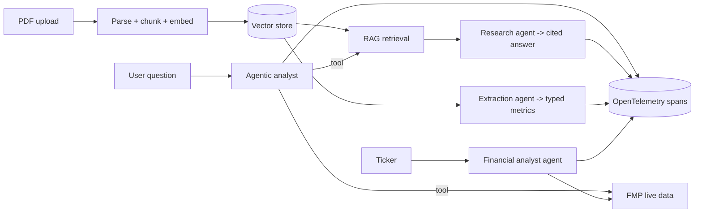
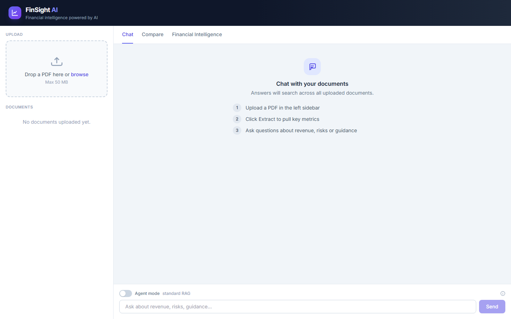
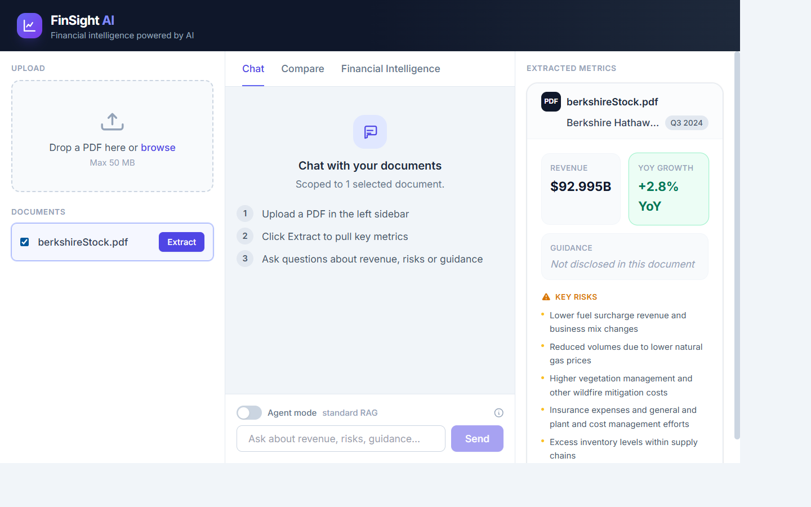
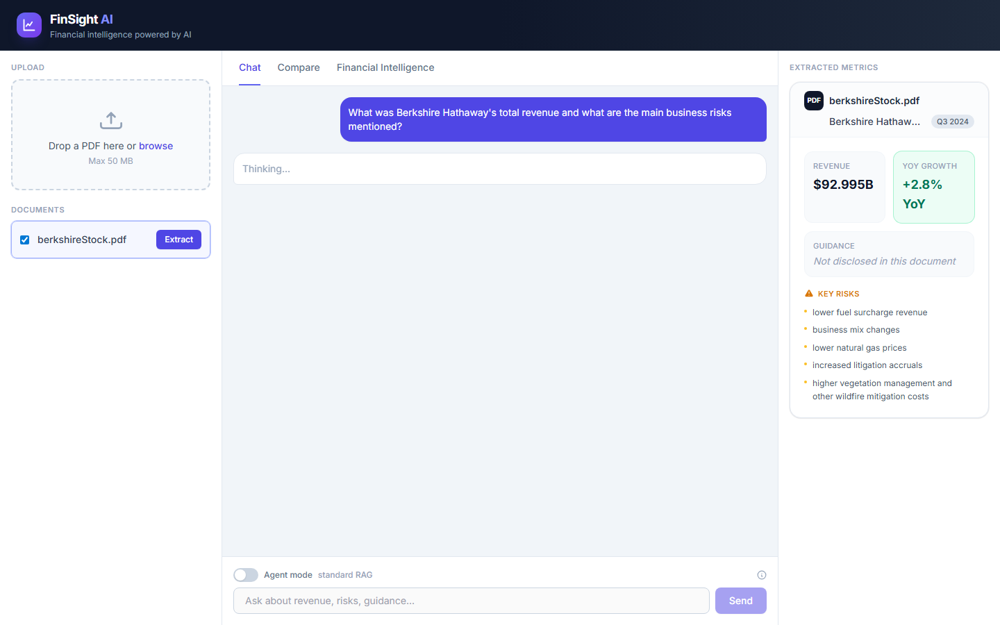
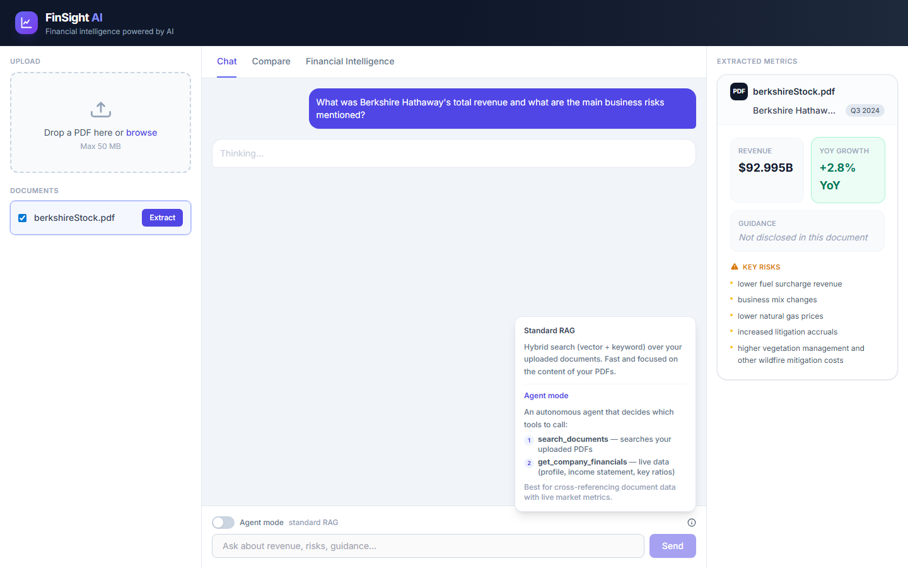
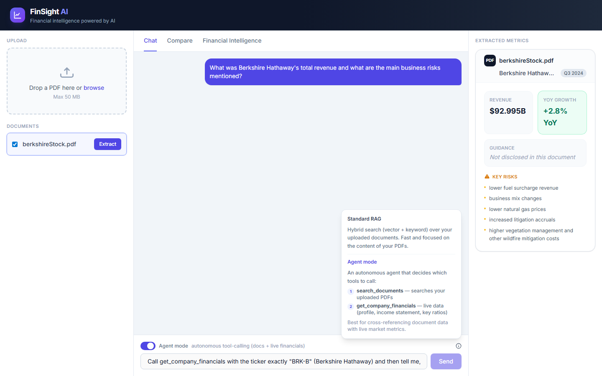
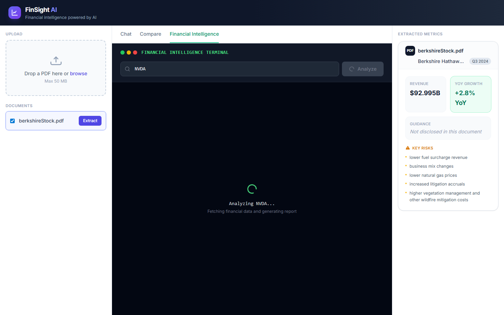

# FinSight AI — Technical Report

A senior-level walkthrough of the engineering behind FinSight AI, with the code that matters for each theme: **Agents / Agentic AI, LLMs, RAG, prompts, MCP, Docker, project structure, and OpenTelemetry**.

> Media: workflow video at [`video/finsight-workflow.webm`](video/finsight-workflow.webm); screenshots in [`screenshots/`](screenshots/).

---

## 1. System at a glance



| Screenshot | Demonstrates |
|---|---|
|  | Upload area — drop a financial PDF to ingest |
|  | LLM extraction → revenue, YoY growth, guidance, key risks |
|  | RAG answer grounded in the income statement, with sources |
|  | Help tooltip contrasting standard RAG vs. agent mode |
|  | Agent mode: autonomous `get_company_financials` tool call with Tools badges |
|  | Deterministic metric cards + AI analyst report |
|  | Scrolled analyst report: ratios, trends, risks, investment insight |

---

## 2. Agentic AI — the autonomous analyst

The analyst agent is *truly agentic*: it receives tools and decides which to call, in what order, and how to combine them. It streams its answer over SSE and reports the tools it used.

**Source:** [`backend/app/agents/analyst_agent.py`](../../backend/app/agents/analyst_agent.py)

```python
agent = Agent(
    model=get_chat_model(),
    deps_type=AnalystDeps,
    output_type=str,
    system_prompt=_SYSTEM_PROMPT,
    retries=_MAX_RETRIES,
    # The NVIDIA llama-3.3 endpoint supports only one tool call per step.
    model_settings={"parallel_tool_calls": False},
)

@agent.tool
async def search_documents(ctx: RunContext[AnalystDeps], query: str) -> str:
    """Search the user's uploaded financial documents for relevant passages."""
    ctx.deps.tools_used.append("search_documents")
    with tracer.start_as_current_span("tool.search_documents") as span:
        span.set_attribute("query_length", len(query))
        try:
            hits = await asyncio.wait_for(
                vector_search(query=query, top_k=_TOOL_TOP_K,
                              document_ids=ctx.deps.document_ids or None),
                timeout=_TOOL_TIMEOUT,
            )
        except asyncio.TimeoutError:
            return "Document search timed out. Please try a narrower query."
        return _truncate("\n\n".join(...))
```

**Why it's production-grade, not a toy loop:**

```python
_USAGE_LIMITS = UsageLimits(
    request_limit=_REQUEST_LIMIT,      # cap total model round-trips
    tool_calls_limit=_TOOL_CALLS_LIMIT # cap total tool invocations
)
# + per-tool asyncio.wait_for timeout
# + _truncate() caps tool output fed back into the context
# + per-tool OpenTelemetry spans
```

Streaming contract (consumed by the frontend `ChatPanel`):

```python
async with agent.run_stream(question, deps=deps,
                            message_history=message_history,
                            usage_limits=_USAGE_LIMITS) as result:
    async for delta in result.stream_text(delta=True):
        yield {"type": "delta", "text": delta}
    yield {"type": "done", "tools_used": deps.tools_used, "messages": ...}
```

**Observed live** (validated): `tools_used = ["search_documents", "get_company_financials"]`, with the market cap pulled from FMP rather than hallucinated.

---

## 3. LLMs — one swap-able provider

**Source:** [`backend/app/services/llm_provider.py`](../../backend/app/services/llm_provider.py)

```python
_PROVIDER_DEFAULTS = {
    "nim":    {"base_url": "https://integrate.api.nvidia.com/v1",
               "api_key_env": "NVIDIA_API_KEY",
               "chat_model": "meta/llama-3.3-70b-instruct",
               "embedding_model": "nvidia/nv-embedqa-e5-v5", "embedding_dims": 1024},
    "ollama": {"base_url": "http://localhost:11434/v1", "api_key_env": None, ...},
    "openai": {"base_url": None, "api_key_env": "OPENAI_API_KEY",
               "chat_model": "gpt-4o-mini", ...},
}
```

Because every provider is OpenAI-compatible, both the PydanticAI model and the raw `AsyncOpenAI` client (used for embeddings) share one SDK. Switching from a cloud 70B model to a local Ollama model is a single env var: `LLM_PROVIDER=ollama`.

---

## 4. RAG — retrieval that degrades gracefully

**Source:** [`backend/app/rag/retrieval.py`](../../backend/app/rag/retrieval.py)

Two backends behind one `retrieve()` function:

```python
_USE_PGVECTOR = not DATABASE_URL.startswith("sqlite")

# Production: native pgvector cosine distance
distance_expr = text("1 - (embedding <=> CAST(:qv AS vector)) AS score")
stmt = (select(...).where(text("1 - (embedding <=> CAST(:qv AS vector)) >= :threshold"))
        .order_by(text("score DESC")).limit(top_k))

# Dev (SQLite): embeddings stored as JSON, cosine computed in Python
```

Every retrieval is wrapped in an OpenTelemetry span (`rag.retrieve`) recording `top_k` and `score_threshold`.

### 4.1 The extraction bug worth highlighting

SEC filings open with pages of legal boilerplate. A Berkshire 10-Q is **227k chars / 69 chunks**, and "Total revenues" first appears at ~char 8,750 — just *past* a naive 8,000-char cutoff. The model only saw the cover page and returned an empty revenue. The fix prioritizes chunks by financial-keyword density before truncation.

**Source:** [`backend/app/api/extract.py`](../../backend/app/api/extract.py)

```python
_FINANCIAL_KEYWORDS = ("total revenues", "total revenue", "revenue",
                       "net earnings", "net income", "operating income",
                       "gross profit", "earnings per share",
                       "income statement", "statements of operations")

def _prioritize_chunks(chunk_texts: list[str]) -> str:
    if len(chunk_texts) <= 1:
        return "\n\n".join(chunk_texts)
    head, rest = chunk_texts[0], chunk_texts[1:]          # keep cover page first
    indexed = list(enumerate(rest))
    indexed.sort(key=lambda pair: (-_financial_score(pair[1]), pair[0]))
    return "\n\n".join([head] + [t for _, t in indexed])
```

**Result (verified):** Berkshire Q3 2024 → `revenue="$92,995 million"`, `growth="+2.8% YoY"`, 5 real risk factors.

---

## 5. Prompts — a versioned registry

Prompts are not scattered inline strings; they live in one reviewable module with env-var overrides for A/B testing.

**Source:** [`backend/app/prompts/__init__.py`](../../backend/app/prompts/__init__.py)

```python
ANALYST_AGENT_SYSTEM = """\
You are an autonomous financial analyst agent...
- Call only ONE tool at a time. Wait for its result before deciding...
- Ground every figure in tool output. Never invent numbers.
"""

def get_prompt(name: str, default: str) -> str:
    """Allow override via PROMPT_<NAME> env var (raw text or a file path)."""
    override = os.getenv(f"PROMPT_{name.upper()}")
    if not override:
        return default
    candidate = Path(override)
    return candidate.read_text(encoding="utf-8") if candidate.is_file() else override
```

The extraction prompt even instructs the model to *compute* YoY growth from current/prior figures rather than guess — which is how `+2.8% YoY` is derived.

---

## 6. MCP — capabilities beyond the web UI

**Source:** [`backend/mcp_server.py`](../../backend/mcp_server.py)

```python
from mcp.server.fastmcp import FastMCP
mcp = FastMCP("FinSight AI", instructions="Financial analysis toolkit...")

@mcp.tool()
async def search_documents(query: str, top_k: int = 5) -> str:
    """Search ingested financial documents for relevant information."""
    results = await vector_search(query=query, top_k=top_k)
    return json.dumps(results, indent=2, default=str)
```

Four tools — `search_documents`, `get_company_financials`, `extract_metrics`, `fetch_sec_filing` — are exposed over stdio and wired into VS Code Copilot via [`.vscode/mcp.json`](../../.vscode/mcp.json). Validated: the server lists all four tools on startup.

> **Honest caveat:** the MCP server reuses the same service layer as the API but is **not** on the web UI's request path, and is not yet covered by CI — a silent-break risk to address before relying on it in production.

---

## 7. OpenTelemetry — traces + correlated logs

**Source:** [`backend/app/telemetry/setup.py`](../../backend/app/telemetry/setup.py)

```python
def setup_telemetry(app):
    provider = TracerProvider()
    if _OTEL_ENDPOINT:
        provider.add_span_processor(
            BatchSpanProcessor(OTLPSpanExporter(endpoint=_OTEL_ENDPOINT)))
    trace.set_tracer_provider(provider)
    FastAPIInstrumentor.instrument_app(app)   # auto-instrument every route
```

- Custom spans wrap retrieval, each agent run, and each tool call.
- A JSON log formatter injects the active `trace_id`/`span_id`, so a log line links straight to its trace.
- `docker compose` ships an **OpenTelemetry Collector** + **Jaeger** (UI on `:16686`).

---

## 8. Docker — full stack with health checks

**Source:** [`docker-compose.yml`](../../docker-compose.yml)

```yaml
services:
  frontend:   { build: ./frontend, ports: ["3000:3000"] }
  backend:    { build: ./backend, ports: ["8002:8002"],
                environment: [REDIS_URL, OTEL_EXPORTER_OTLP_ENDPOINT],
                depends_on: { db: {condition: service_healthy},
                              redis: {condition: service_healthy} } }
  db:         { image: pgvector/pgvector:pg16, healthcheck: pg_isready }
  redis:      { image: redis:7-alpine, healthcheck: redis-cli ping }
  otel-collector: { image: otel/opentelemetry-collector-contrib }
  jaeger:     { image: jaegertracing/all-in-one }   # UI :16686
```

Six services, dependency ordering by health, named volumes for Postgres and Redis. One `docker compose up --build` brings up the entire platform including tracing.

---

## 9. Production hardening checklist

| Concern | Mechanism |
|---|---|
| Runaway agent cost | `UsageLimits` + per-tool timeouts + output truncation |
| Upstream API failure | FMP circuit breaker (5 failures → 30s cooldown) |
| Abuse | Fixed-window rate-limit middleware (Redis or in-process) |
| Auth | Optional API-key middleware; health endpoints stay public |
| Liveness/readiness | `/health/live`, `/health/ready` (DB + Redis) |
| Malicious upload | `%PDF-` magic bytes, encrypted-file rejection, page cap |
| Memory across turns | Redis-backed conversation store, in-process fallback |
| Regressions | CI: Recall@K/MRR + groundedness evals, ruff, pytest |

---

## 10. Honest limitations (for the report's integrity)

- **FMP free plan** returns `402` for income-statement / ratios / earnings; live analysis runs on `profile` data and the app degrades gracefully.
- **Conversation memory** falls back to in-process without Redis — fine for a single instance, lossy across replicas.
- **MCP server** works but is untested in CI.
- **70B latency** — answers take tens of seconds on the free NIM tier; acceptable for a demo, would warrant streaming-everywhere + a smaller fast-path model in production.

---

## 11. Pre-publish action items

1. **Rotate the NVIDIA and FMP API keys** — they were briefly committed; treat them as compromised.
2. Force-push the cleaned git history (secrets purged with `git filter-repo`).
3. Ship a committed `.env.example`; keep real `.env` files git-ignored.
</content>
